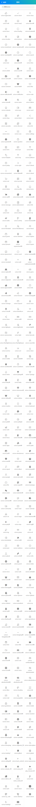

> ## 内置图标



### 1. 引入样式

编辑 `App.vue`文件在`<style>` 项引入 `icon.css`
```
<style>
	@import "colorui/main.css";
	@import "colorui/icon.css";
</style>
```
### 2. 使用语法

```
<标签 class="cuIcon-图标名称"></标签>
```

### 3. 已有图标

```
.cuIcon-appreciate
.cuIcon-check
.cuIcon-close
.cuIcon-edit
.cuIcon-emoji
.cuIcon-favorfill
.cuIcon-favor
.cuIcon-loading
.cuIcon-locationfill
.cuIcon-location
.cuIcon-phone
.cuIcon-roundcheckfill
.cuIcon-roundcheck
.cuIcon-roundclosefill
.cuIcon-roundclose
.cuIcon-roundrightfill
.cuIcon-roundright
.cuIcon-search
.cuIcon-taxi
.cuIcon-timefill
.cuIcon-time
.cuIcon-unfold
.cuIcon-warnfill
.cuIcon-warn
.cuIcon-camerafill
.cuIcon-camera
.cuIcon-commentfill
.cuIcon-comment
.cuIcon-likefill
.cuIcon-like
.cuIcon-notificationfill
.cuIcon-notification
.cuIcon-order
.cuIcon-samefill
.cuIcon-same
.cuIcon-deliver
.cuIcon-evaluate
.cuIcon-pay
.cuIcon-send
.cuIcon-shop
.cuIcon-ticket
.cuIcon-back
.cuIcon-cascades
.cuIcon-discover
.cuIcon-list
.cuIcon-more
.cuIcon-scan
.cuIcon-settings
.cuIcon-questionfill
.cuIcon-question
.cuIcon-shopfill
.cuIcon-form
.cuIcon-pic
.cuIcon-filter
.cuIcon-footprint
.cuIcon-top
.cuIcon-pulldown
.cuIcon-pullup
.cuIcon-right
.cuIcon-refresh
.cuIcon-moreandroid
.cuIcon-deletefill
.cuIcon-refund
.cuIcon-cart
.cuIcon-qrcode
.cuIcon-remind
.cuIcon-delete
.cuIcon-profile
.cuIcon-home
.cuIcon-cartfill
.cuIcon-discoverfill
.cuIcon-homefill
.cuIcon-message
.cuIcon-addressbook
.cuIcon-link
.cuIcon-lock
.cuIcon-unlock
.cuIcon-vip
.cuIcon-weibo
.cuIcon-activity
.cuIcon-friendaddfill
.cuIcon-friendadd
.cuIcon-friendfamous
.cuIcon-friend
.cuIcon-goods
.cuIcon-selection
.cuIcon-explore
.cuIcon-present
.cuIcon-squarecheckfill
.cuIcon-square
.cuIcon-squarecheck
.cuIcon-round
.cuIcon-roundaddfill
.cuIcon-roundadd
.cuIcon-add
.cuIcon-notificationforbidfill
.cuIcon-explorefill
.cuIcon-fold
.cuIcon-game
.cuIcon-redpacket
.cuIcon-selectionfill
.cuIcon-similar
.cuIcon-appreciatefill
.cuIcon-infofill
.cuIcon-info
.cuIcon-forwardfill
.cuIcon-forward
.cuIcon-rechargefill
.cuIcon-recharge
.cuIcon-vipcard
.cuIcon-voice
.cuIcon-voicefill
.cuIcon-friendfavor
.cuIcon-wifi
.cuIcon-share
.cuIcon-wefill
.cuIcon-we
.cuIcon-lightauto
.cuIcon-lightforbid
.cuIcon-lightfill
.cuIcon-camerarotate
.cuIcon-light
.cuIcon-barcode
.cuIcon-flashlightclose
.cuIcon-flashlightopen
.cuIcon-searchlist
.cuIcon-service
.cuIcon-sort
.cuIcon-down
.cuIcon-mobile
.cuIcon-mobilefill
.cuIcon-copy
.cuIcon-countdownfill
.cuIcon-countdown
.cuIcon-noticefill
.cuIcon-notice
.cuIcon-upstagefill
.cuIcon-upstage
.cuIcon-babyfill
.cuIcon-baby
.cuIcon-brandfill
.cuIcon-brand
.cuIcon-choicenessfill
.cuIcon-choiceness
.cuIcon-clothesfill
.cuIcon-clothes
.cuIcon-creativefill
.cuIcon-creative
.cuIcon-female
.cuIcon-keyboard
.cuIcon-male
.cuIcon-newfill
.cuIcon-new
.cuIcon-pullleft
.cuIcon-pullright
.cuIcon-rankfill
.cuIcon-rank
.cuIcon-bad
.cuIcon-cameraadd
.cuIcon-focus
.cuIcon-friendfill
.cuIcon-cameraaddfill
.cuIcon-apps
.cuIcon-paintfill
.cuIcon-paint
.cuIcon-picfill
.cuIcon-refresharrow
.cuIcon-colorlens
.cuIcon-markfill
.cuIcon-mark
.cuIcon-presentfill
.cuIcon-repeal
.cuIcon-album
.cuIcon-peoplefill
.cuIcon-people
.cuIcon-servicefill
.cuIcon-repair
.cuIcon-file
.cuIcon-repairfill
.cuIcon-taoxiaopu
.cuIcon-weixin
.cuIcon-attentionfill
.cuIcon-attention
.cuIcon-commandfill
.cuIcon-command
.cuIcon-communityfill
.cuIcon-community
.cuIcon-read
.cuIcon-calendar
.cuIcon-cut
.cuIcon-magic
.cuIcon-backwardfill
.cuIcon-playfill
.cuIcon-stop
.cuIcon-tagfill
.cuIcon-tag
.cuIcon-group
.cuIcon-all
.cuIcon-backdelete
.cuIcon-hotfill
.cuIcon-hot
.cuIcon-post
.cuIcon-radiobox
.cuIcon-rounddown
.cuIcon-upload
.cuIcon-writefill
.cuIcon-write
.cuIcon-radioboxfill
.cuIcon-punch
.cuIcon-shake
.cuIcon-move
.cuIcon-safe
.cuIcon-activityfill
.cuIcon-crownfill
.cuIcon-crown
.cuIcon-goodsfill
.cuIcon-messagefill
.cuIcon-profilefill
.cuIcon-sound
.cuIcon-sponsorfill
.cuIcon-sponsor
.cuIcon-upblock
.cuIcon-weblock
.cuIcon-weunblock
.cuIcon-my
.cuIcon-myfill
.cuIcon-emojifill
.cuIcon-emojiflashfill
.cuIcon-flashbuyfill
.cuIcon-text
.cuIcon-goodsfavor
.cuIcon-musicfill
.cuIcon-musicforbidfill
.cuIcon-card
.cuIcon-triangledownfill
.cuIcon-triangleupfill
.cuIcon-roundleftfill
.cuIcon-font
.cuIcon-title
.cuIcon-recordfill
.cuIcon-record
.cuIcon-cardboardfill
.cuIcon-cardboard
.cuIcon-formfill
.cuIcon-coin
.cuIcon-cardboardforbid
.cuIcon-circlefill
.cuIcon-circle
.cuIcon-attentionforbid
.cuIcon-attentionforbidfill
.cuIcon-attentionfavorfill
.cuIcon-attentionfavor
.cuIcon-titles
.cuIcon-icloading
.cuIcon-full
.cuIcon-mail
.cuIcon-peoplelist
.cuIcon-goodsnewfill
.cuIcon-goodsnew
.cuIcon-medalfill
.cuIcon-medal
.cuIcon-newsfill
.cuIcon-newshotfill
.cuIcon-newshot
.cuIcon-news
.cuIcon-videofill
.cuIcon-video
.cuIcon-exit
.cuIcon-skinfill
.cuIcon-skin
.cuIcon-moneybagfill
.cuIcon-usefullfill
.cuIcon-usefull
.cuIcon-moneybag
.cuIcon-redpacket_fill
.cuIcon-subscription
.cuIcon-loading1
.cuIcon-github
.cuIcon-global
.cuIcon-settingsfill
.cuIcon-back_android
.cuIcon-expressman
.cuIcon-evaluate_fill
.cuIcon-group_fill
.cuIcon-play_forward_fill
.cuIcon-deliver_fill
.cuIcon-notice_forbid_fill
.cuIcon-fork
.cuIcon-pick
.cuIcon-wenzi
.cuIcon-ellipse
.cuIcon-qr_code
.cuIcon-dianhua
.cuIcon-cuIcon
.cuIcon-loading2
.cuIcon-btn
```

> ## 演示代码

```
<template>
	<view>
		<cu-custom bgColor="bg-gradual-blue" :isBack="true"><block slot="backText">返回</block><block slot="content">图标</block></cu-custom>
		<view class="cu-bar bg-white search fixed" :style="[{top:CustomBar + 'px'}]">
			<view class="search-form round">
				<text class="cuIcon-search"></text>
				<input type="text" placeholder="搜索cuIcon" confirm-type="search" @input="searchIcon"></input>
			</view>
		</view>
		<view class="cu-list grid col-3" style="margin-top:16rpx;">
			<view class="cu-item" v-for="(item,index) in cuIcon" :key="index" v-if="item.isShow">
				<text class="lg text-gray" :class="'cuIcon-' + item.name"></text>
				<text>cuIcon-{{item.name}}</text>
			</view>
		</view>
	</view>
</template>

<script>
	export default {
		data() {
			return {
				CustomBar: this.CustomBar,
				cuIcon: [{
					name: 'appreciate',
					isShow: true
				}, {
					name: 'check',
					isShow: true
				}, {
					name: 'close',
					isShow: true
				}, {
					name: 'edit',
					isShow: true
				}, {
					name: 'emoji',
					isShow: true
				}, {
					name: 'favorfill',
					isShow: true
				}, {
					name: 'favor',
					isShow: true
				}, {
					name: 'loading',
					isShow: true
				}, {
					name: 'locationfill',
					isShow: true
				}, {
					name: 'location',
					isShow: true
				}, {
					name: 'phone',
					isShow: true
				}, {
					name: 'roundcheckfill',
					isShow: true
				}, {
					name: 'roundcheck',
					isShow: true
				}, {
					name: 'roundclosefill',
					isShow: true
				}, {
					name: 'roundclose',
					isShow: true
				}, {
					name: 'roundrightfill',
					isShow: true
				}, {
					name: 'roundright',
					isShow: true
				}, {
					name: 'search',
					isShow: true
				}, {
					name: 'taxi',
					isShow: true
				}, {
					name: 'timefill',
					isShow: true
				}, {
					name: 'time',
					isShow: true
				}, {
					name: 'unfold',
					isShow: true
				}, {
					name: 'warnfill',
					isShow: true
				}, {
					name: 'warn',
					isShow: true
				}, {
					name: 'camerafill',
					isShow: true
				}, {
					name: 'camera',
					isShow: true
				}, {
					name: 'commentfill',
					isShow: true
				}, {
					name: 'comment',
					isShow: true
				}, {
					name: 'likefill',
					isShow: true
				}, {
					name: 'like',
					isShow: true
				}, {
					name: 'notificationfill',
					isShow: true
				}, {
					name: 'notification',
					isShow: true
				}, {
					name: 'order',
					isShow: true
				}, {
					name: 'samefill',
					isShow: true
				}, {
					name: 'same',
					isShow: true
				}, {
					name: 'deliver',
					isShow: true
				}, {
					name: 'evaluate',
					isShow: true
				}, {
					name: 'pay',
					isShow: true
				}, {
					name: 'send',
					isShow: true
				}, {
					name: 'shop',
					isShow: true
				}, {
					name: 'ticket',
					isShow: true
				}, {
					name: 'back',
					isShow: true
				}, {
					name: 'cascades',
					isShow: true
				}, {
					name: 'discover',
					isShow: true
				}, {
					name: 'list',
					isShow: true
				}, {
					name: 'more',
					isShow: true
				}, {
					name: 'scan',
					isShow: true
				}, {
					name: 'settings',
					isShow: true
				}, {
					name: 'questionfill',
					isShow: true
				}, {
					name: 'question',
					isShow: true
				}, {
					name: 'shopfill',
					isShow: true
				}, {
					name: 'form',
					isShow: true
				}, {
					name: 'pic',
					isShow: true
				}, {
					name: 'filter',
					isShow: true
				}, {
					name: 'footprint',
					isShow: true
				}, {
					name: 'top',
					isShow: true
				}, {
					name: 'pulldown',
					isShow: true
				}, {
					name: 'pullup',
					isShow: true
				}, {
					name: 'right',
					isShow: true
				}, {
					name: 'refresh',
					isShow: true
				}, {
					name: 'moreandroid',
					isShow: true
				}, {
					name: 'deletefill',
					isShow: true
				}, {
					name: 'refund',
					isShow: true
				}, {
					name: 'cart',
					isShow: true
				}, {
					name: 'qrcode',
					isShow: true
				}, {
					name: 'remind',
					isShow: true
				}, {
					name: 'delete',
					isShow: true
				}, {
					name: 'profile',
					isShow: true
				}, {
					name: 'home',
					isShow: true
				}, {
					name: 'cartfill',
					isShow: true
				}, {
					name: 'discoverfill',
					isShow: true
				}, {
					name: 'homefill',
					isShow: true
				}, {
					name: 'message',
					isShow: true
				}, {
					name: 'addressbook',
					isShow: true
				}, {
					name: 'link',
					isShow: true
				}, {
					name: 'lock',
					isShow: true
				}, {
					name: 'unlock',
					isShow: true
				}, {
					name: 'vip',
					isShow: true
				}, {
					name: 'weibo',
					isShow: true
				}, {
					name: 'activity',
					isShow: true
				}, {
					name: 'friendaddfill',
					isShow: true
				}, {
					name: 'friendadd',
					isShow: true
				}, {
					name: 'friendfamous',
					isShow: true
				}, {
					name: 'friend',
					isShow: true
				}, {
					name: 'goods',
					isShow: true
				}, {
					name: 'selection',
					isShow: true
				}, {
					name: 'explore',
					isShow: true
				}, {
					name: 'present',
					isShow: true
				}, {
					name: 'squarecheckfill',
					isShow: true
				}, {
					name: 'square',
					isShow: true
				}, {
					name: 'squarecheck',
					isShow: true
				}, {
					name: 'round',
					isShow: true
				}, {
					name: 'roundaddfill',
					isShow: true
				}, {
					name: 'roundadd',
					isShow: true
				}, {
					name: 'add',
					isShow: true
				}, {
					name: 'notificationforbidfill',
					isShow: true
				}, {
					name: 'explorefill',
					isShow: true
				}, {
					name: 'fold',
					isShow: true
				}, {
					name: 'game',
					isShow: true
				}, {
					name: 'redpacket',
					isShow: true
				}, {
					name: 'selectionfill',
					isShow: true
				}, {
					name: 'similar',
					isShow: true
				}, {
					name: 'appreciatefill',
					isShow: true
				}, {
					name: 'infofill',
					isShow: true
				}, {
					name: 'info',
					isShow: true
				}, {
					name: 'forwardfill',
					isShow: true
				}, {
					name: 'forward',
					isShow: true
				}, {
					name: 'rechargefill',
					isShow: true
				}, {
					name: 'recharge',
					isShow: true
				}, {
					name: 'vipcard',
					isShow: true
				}, {
					name: 'voice',
					isShow: true
				}, {
					name: 'voicefill',
					isShow: true
				}, {
					name: 'friendfavor',
					isShow: true
				}, {
					name: 'wifi',
					isShow: true
				}, {
					name: 'share',
					isShow: true
				}, {
					name: 'wefill',
					isShow: true
				}, {
					name: 'we',
					isShow: true
				}, {
					name: 'lightauto',
					isShow: true
				}, {
					name: 'lightforbid',
					isShow: true
				}, {
					name: 'lightfill',
					isShow: true
				}, {
					name: 'camerarotate',
					isShow: true
				}, {
					name: 'light',
					isShow: true
				}, {
					name: 'barcode',
					isShow: true
				}, {
					name: 'flashlightclose',
					isShow: true
				}, {
					name: 'flashlightopen',
					isShow: true
				}, {
					name: 'searchlist',
					isShow: true
				}, {
					name: 'service',
					isShow: true
				}, {
					name: 'sort',
					isShow: true
				}, {
					name: 'down',
					isShow: true
				}, {
					name: 'mobile',
					isShow: true
				}, {
					name: 'mobilefill',
					isShow: true
				}, {
					name: 'copy',
					isShow: true
				}, {
					name: 'countdownfill',
					isShow: true
				}, {
					name: 'countdown',
					isShow: true
				}, {
					name: 'noticefill',
					isShow: true
				}, {
					name: 'notice',
					isShow: true
				}, {
					name: 'upstagefill',
					isShow: true
				}, {
					name: 'upstage',
					isShow: true
				}, {
					name: 'babyfill',
					isShow: true
				}, {
					name: 'baby',
					isShow: true
				}, {
					name: 'brandfill',
					isShow: true
				}, {
					name: 'brand',
					isShow: true
				}, {
					name: 'choicenessfill',
					isShow: true
				}, {
					name: 'choiceness',
					isShow: true
				}, {
					name: 'clothesfill',
					isShow: true
				}, {
					name: 'clothes',
					isShow: true
				}, {
					name: 'creativefill',
					isShow: true
				}, {
					name: 'creative',
					isShow: true
				}, {
					name: 'female',
					isShow: true
				}, {
					name: 'keyboard',
					isShow: true
				}, {
					name: 'male',
					isShow: true
				}, {
					name: 'newfill',
					isShow: true
				}, {
					name: 'new',
					isShow: true
				}, {
					name: 'pullleft',
					isShow: true
				}, {
					name: 'pullright',
					isShow: true
				}, {
					name: 'rankfill',
					isShow: true
				}, {
					name: 'rank',
					isShow: true
				}, {
					name: 'bad',
					isShow: true
				}, {
					name: 'cameraadd',
					isShow: true
				}, {
					name: 'focus',
					isShow: true
				}, {
					name: 'friendfill',
					isShow: true
				}, {
					name: 'cameraaddfill',
					isShow: true
				}, {
					name: 'apps',
					isShow: true
				}, {
					name: 'paintfill',
					isShow: true
				}, {
					name: 'paint',
					isShow: true
				}, {
					name: 'picfill',
					isShow: true
				}, {
					name: 'refresharrow',
					isShow: true
				}, {
					name: 'colorlens',
					isShow: true
				}, {
					name: 'markfill',
					isShow: true
				}, {
					name: 'mark',
					isShow: true
				}, {
					name: 'presentfill',
					isShow: true
				}, {
					name: 'repeal',
					isShow: true
				}, {
					name: 'album',
					isShow: true
				}, {
					name: 'peoplefill',
					isShow: true
				}, {
					name: 'people',
					isShow: true
				}, {
					name: 'servicefill',
					isShow: true
				}, {
					name: 'repair',
					isShow: true
				}, {
					name: 'file',
					isShow: true
				}, {
					name: 'repairfill',
					isShow: true
				}, {
					name: 'taoxiaopu',
					isShow: true
				}, {
					name: 'weixin',
					isShow: true
				}, {
					name: 'attentionfill',
					isShow: true
				}, {
					name: 'attention',
					isShow: true
				}, {
					name: 'commandfill',
					isShow: true
				}, {
					name: 'command',
					isShow: true
				}, {
					name: 'communityfill',
					isShow: true
				}, {
					name: 'community',
					isShow: true
				}, {
					name: 'read',
					isShow: true
				}, {
					name: 'calendar',
					isShow: true
				}, {
					name: 'cut',
					isShow: true
				}, {
					name: 'magic',
					isShow: true
				}, {
					name: 'backwardfill',
					isShow: true
				}, {
					name: 'playfill',
					isShow: true
				}, {
					name: 'stop',
					isShow: true
				}, {
					name: 'tagfill',
					isShow: true
				}, {
					name: 'tag',
					isShow: true
				}, {
					name: 'group',
					isShow: true
				}, {
					name: 'all',
					isShow: true
				}, {
					name: 'backdelete',
					isShow: true
				}, {
					name: 'hotfill',
					isShow: true
				}, {
					name: 'hot',
					isShow: true
				}, {
					name: 'post',
					isShow: true
				}, {
					name: 'radiobox',
					isShow: true
				}, {
					name: 'rounddown',
					isShow: true
				}, {
					name: 'upload',
					isShow: true
				}, {
					name: 'writefill',
					isShow: true
				}, {
					name: 'write',
					isShow: true
				}, {
					name: 'radioboxfill',
					isShow: true
				}, {
					name: 'punch',
					isShow: true
				}, {
					name: 'shake',
					isShow: true
				}, {
					name: 'move',
					isShow: true
				}, {
					name: 'safe',
					isShow: true
				}, {
					name: 'activityfill',
					isShow: true
				}, {
					name: 'crownfill',
					isShow: true
				}, {
					name: 'crown',
					isShow: true
				}, {
					name: 'goodsfill',
					isShow: true
				}, {
					name: 'messagefill',
					isShow: true
				}, {
					name: 'profilefill',
					isShow: true
				}, {
					name: 'sound',
					isShow: true
				}, {
					name: 'sponsorfill',
					isShow: true
				}, {
					name: 'sponsor',
					isShow: true
				}, {
					name: 'upblock',
					isShow: true
				}, {
					name: 'weblock',
					isShow: true
				}, {
					name: 'weunblock',
					isShow: true
				}, {
					name: 'my',
					isShow: true
				}, {
					name: 'myfill',
					isShow: true
				}, {
					name: 'emojifill',
					isShow: true
				}, {
					name: 'emojiflashfill',
					isShow: true
				}, {
					name: 'flashbuyfill',
					isShow: true
				}, {
					name: 'text',
					isShow: true
				}, {
					name: 'goodsfavor',
					isShow: true
				}, {
					name: 'musicfill',
					isShow: true
				}, {
					name: 'musicforbidfill',
					isShow: true
				}, {
					name: 'card',
					isShow: true
				}, {
					name: 'triangledownfill',
					isShow: true
				}, {
					name: 'triangleupfill',
					isShow: true
				}, {
					name: 'roundleftfill-copy',
					isShow: true
				}, {
					name: 'font',
					isShow: true
				}, {
					name: 'title',
					isShow: true
				}, {
					name: 'recordfill',
					isShow: true
				}, {
					name: 'record',
					isShow: true
				}, {
					name: 'cardboardfill',
					isShow: true
				}, {
					name: 'cardboard',
					isShow: true
				}, {
					name: 'formfill',
					isShow: true
				}, {
					name: 'coin',
					isShow: true
				}, {
					name: 'cardboardforbid',
					isShow: true
				}, {
					name: 'circlefill',
					isShow: true
				}, {
					name: 'circle',
					isShow: true
				}, {
					name: 'attentionforbid',
					isShow: true
				}, {
					name: 'attentionforbidfill',
					isShow: true
				}, {
					name: 'attentionfavorfill',
					isShow: true
				}, {
					name: 'attentionfavor',
					isShow: true
				}, {
					name: 'titles',
					isShow: true
				}, {
					name: 'icloading',
					isShow: true
				}, {
					name: 'full',
					isShow: true
				}, {
					name: 'mail',
					isShow: true
				}, {
					name: 'peoplelist',
					isShow: true
				}, {
					name: 'goodsnewfill',
					isShow: true
				}, {
					name: 'goodsnew',
					isShow: true
				}, {
					name: 'medalfill',
					isShow: true
				}, {
					name: 'medal',
					isShow: true
				}, {
					name: 'newsfill',
					isShow: true
				}, {
					name: 'newshotfill',
					isShow: true
				}, {
					name: 'newshot',
					isShow: true
				}, {
					name: 'news',
					isShow: true
				}, {
					name: 'videofill',
					isShow: true
				}, {
					name: 'video',
					isShow: true
				}, {
					name: 'exit',
					isShow: true
				}, {
					name: 'skinfill',
					isShow: true
				}, {
					name: 'skin',
					isShow: true
				}, {
					name: 'moneybagfill',
					isShow: true
				}, {
					name: 'usefullfill',
					isShow: true
				}, {
					name: 'usefull',
					isShow: true
				}, {
					name: 'moneybag',
					isShow: true
				}, {
					name: 'redpacket_fill',
					isShow: true
				}, {
					name: 'subscription',
					isShow: true
				}, {
					name: 'loading1',
					isShow: true
				}, {
					name: 'github',
					isShow: true
				}, {
					name: 'global',
					isShow: true
				}, {
					name: 'settingsfill',
					isShow: true
				}, {
					name: 'back_android',
					isShow: true
				}, {
					name: 'expressman',
					isShow: true
				}, {
					name: 'evaluate_fill',
					isShow: true
				}, {
					name: 'group_fill',
					isShow: true
				}, {
					name: 'play_forward_fill',
					isShow: true
				}, {
					name: 'deliver_fill',
					isShow: true
				}, {
					name: 'notice_forbid_fill',
					isShow: true
				}, {
					name: 'fork',
					isShow: true
				}, {
					name: 'pick',
					isShow: true
				}, {
					name: 'wenzi',
					isShow: true
				}, {
					name: 'ellipse',
					isShow: true
				}, {
					name: 'qr_code',
					isShow: true
				}, {
					name: 'dianhua',
					isShow: true
				}, {
					name: 'cuIcon',
					isShow: true
				}, {
					name: 'loading2',
					isShow: true
				}, {
					name: 'btn',
					isShow: true
				}]

			};
		},
		methods: {
			searchIcon(e) {
				let key = e.detail.value.toLowerCase();
				let list = this.cuIcon;
				for (let i = 0; i < list.length; i++) {
					let a = key;
					let b = list[i].name.toLowerCase();
					if (b.search(a) != -1) {
						list[i].isShow = true
					} else {
						list[i].isShow = false
					}
				}
				this.cuIcon = list
			}
		}
	}
</script>

<style>
	page {
		padding-top: 50px;
	}
</style>

```