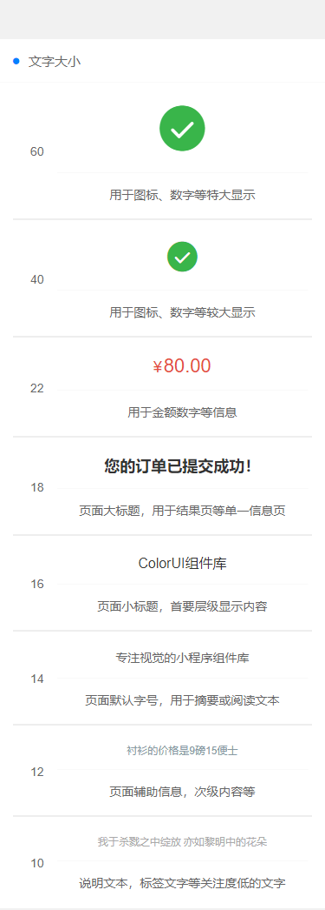

> ## 文字大小



### 文字样式
```
.text-xsl  文字大小 60px 用于图标、数字等特大显示
.text-sl   文字大小 40px 用于图标、数字等较大显示
.text-xxl  文字大小 22px 用于金额数字等信息
.text-xl   文字大小 18px 页面大标题，用于结果页等单一信息页
.text-lg   文字大小 16px 页面小标题，首要层级显示内容
.text-df   文字大小 14px 页面默认字号，用于摘要或阅读文本
.text-sm   文字大小 12px 页面辅助信息，次级内容等
.text-xs   文字大小 10px 说明文本，标签文字等关注度低的文字
```

> ## 演示代码

```
<template>
	<view>
		<view class="cu-bar bg-white solid-bottom">
			<view class="action">
				<text class="cuIcon-title text-blue"></text>文字大小
			</view>
		</view>
		<view class="bg-white padding-lr">
			<view class="solids-bottom padding-xs flex align-center">
				<view class="padding">60</view>
				<view class="flex-sub text-center">
					<view class="solid-bottom text-xsl padding">
						<text class=" cuIcon-roundcheckfill text-green"></text>
					</view>
					<view class="padding">用于图标、数字等特大显示</view>
				</view>
			</view>
			<view class="solids-bottom padding-xs flex align-center">
				<view class="padding">40</view>
				<view class="flex-sub text-center">
					<view class="solid-bottom text-sl padding">
						<text class=" cuIcon-roundcheckfill text-green"></text>
					</view>
					<view class="padding">用于图标、数字等较大显示</view>
				</view>
			</view>
			<view class="solids-bottom padding-xs flex align-center">
				<view class="padding">22</view>
				<view class="flex-sub text-center">
					<view class="solid-bottom text-xxl padding">
						<text class="text-price text-red">80.00</text>
					</view>
					<view class="padding">用于金额数字等信息</view>
				</view>
			</view>
			<view class="solids-bottom padding-xs flex align-center">
				<view class="padding">18</view>
				<view class="flex-sub text-center">
					<view class="solid-bottom text-xl padding">
						<text class="text-black text-bold">您的订单已提交成功！</text>
					</view>
					<view class="padding">页面大标题，用于结果页等单一信息页</view>
				</view>
			</view>
			<view class="solids-bottom padding-xs flex align-center">
				<view class="padding">16</view>
				<view class="flex-sub text-center">
					<view class="solid-bottom text-lg padding">
						<text class="text-black">ColorUI组件库</text>
					</view>
					<view class="padding">页面小标题，首要层级显示内容</view>
				</view>
			</view>
			<view class="solids-bottom padding-xs flex align-center">
				<view class="padding">14</view>
				<view class="flex-sub text-center">
					<view class="solid-bottom text-df padding">专注视觉的小程序组件库</view>
					<view class="padding">页面默认字号，用于摘要或阅读文本</view>
				</view>
			</view>
			<view class="solids-bottom padding-xs flex align-center">
				<view class="padding">12</view>
				<view class="flex-sub text-center">
					<view class="solid-bottom text-sm padding">
						<text class="text-grey">衬衫的价格是9磅15便士</text>
					</view>
					<view class="padding">页面辅助信息，次级内容等</view>
				</view>
			</view>
			<view class="padding-xs flex align-center">
				<view class="padding">10</view>
				<view class="flex-sub text-center">
					<view class="solid-bottom text-xs padding">
						<text class="text-gray">我于杀戮之中绽放 亦如黎明中的花朵</text>
					</view>
					<view class="padding">说明文本，标签文字等关注度低的文字</view>
				</view>
			</view>
		</view>
    </view>
</template>
```