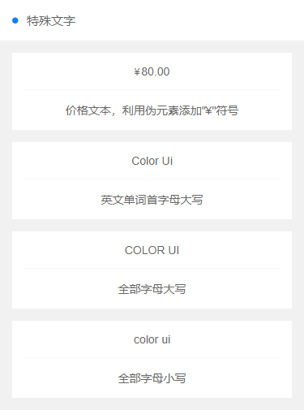

# 文字对齐


## 对齐样式
```
.text-left  左对齐
.text-center  居中对齐
.text-right  右对齐
```

## 演示代码

```
<template>
    <view class="padding bg-white">
        <view class="text-left padding">我于杀戮之中绽放 ,亦如黎明中的花朵</view>
        <view class="text-center padding">我于杀戮之中绽放 ,亦如黎明中的花朵</view>
        <view class="text-right padding">我于杀戮之中绽放 ,亦如黎明中的花朵</view>
	</view>
</template>

```