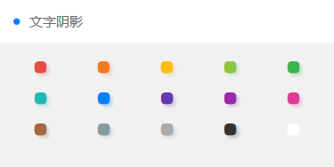

> ## 文字阴影



### 阴影样式

```
.text-shadow  {
     /* h-shadow 水平阴影的位置 v-shadow 垂直阴影的位置 blur 模糊的距离 color 阴影的颜色; */
    text-shadow: 3px 3px 4px rgba(204, 69, 59, 0.2);
}

```

> ## 演示代码

```
<template>
    <view class="grid bg-white col-5 padding-sm">
			<view class="padding-sm" v-for="(item,index) in ColorList" :key="index">
				<view class="text-center text-shadow" :class="'text-' + item.name">
					<view class="cuIcon-ellipse text-xxl"></view>
				</view>
			</view>
		</view>
</template>

<script>
	export default {
		data() {
			return {
				ColorList: [{
                        title: '嫣红',
                        name: 'red',
                        color: '#e54d42'
                    },
                    {
                        title: '桔橙',
                        name: 'orange',
                        color: '#f37b1d'
                    },
                    {
                        title: '明黄',
                        name: 'yellow',
                        color: '#fbbd08'
                    },
                    {
                        title: '橄榄',
                        name: 'olive',
                        color: '#8dc63f'
                    },
                    {
                        title: '森绿',
                        name: 'green',
                        color: '#39b54a'
                    },
                    {
                        title: '天青',
                        name: 'cyan',
                        color: '#1cbbb4'
                    },
                    {
                        title: '海蓝',
                        name: 'blue',
                        color: '#0081ff'
                    },
                    {
                        title: '姹紫',
                        name: 'purple',
                        color: '#6739b6'
                    },
                    {
                        title: '木槿',
                        name: 'mauve',
                        color: '#9c26b0'
                    },
                    {
                        title: '桃粉',
                        name: 'pink',
                        color: '#e03997'
                    },
                    {
                        title: '棕褐',
                        name: 'brown',
                        color: '#a5673f'
                    },
                    {
                        title: '玄灰',
                        name: 'grey',
                        color: '#8799a3'
                    },
                    {
                        title: '草灰',
                        name: 'gray',
                        color: '#aaaaaa'
                    },
                    {
                        title: '墨黑',
                        name: 'black',
                        color: '#333333'
                    },
                    {
                        title: '雅白',
                        name: 'white',
                        color: '#ffffff'
                    },
                ]
			};
		}
	}
</script>

```