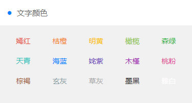

# 文字颜色


## 颜色样式

```
.text-red  /* 嫣红 #e54d42 */
.text-orange  /* 桔橙 #f37b1d */
.text-yellow  /* 明黄 #fbbd08 */
.text-olive  /* 橄榄 #8dc63f */
.text-green  /* 森绿 #39b54a */
.text-cyan  /* 天青 #1cbbb4 */
.text-blue  /* 海蓝 #0081ff */
.text-purple  /* 姹紫 #6739b6 */
.text-mauve  /* 木槿 #9c26b0 */
.text-pink  /* 桃粉 #e03997 */
.text-brown  /* 棕褐 #a5673f */
.text-grey  /* 玄灰 #8799a3 */
.text-gray  /* 草灰 #aaaaaa */
.text-black  /* 墨黑 #333333 */
.text-white  /* 雅白 #ffffff */
```

## 演示代码

```
<template>
    <view class="grid col-5 padding-sm">
		<view class="padding-sm" v-for="(item,index) in ColorList" :key="index">
			<view class="text-center" :class="'text-' + item.name">
				{{item.title}}
			</view>
		</view>
	</view>
</template>

<script>
	export default {
		data() {
			return {
				ColorList: [{
                        title: '嫣红',
                        name: 'red',
                        color: '#e54d42'
                    },
                    {
                        title: '桔橙',
                        name: 'orange',
                        color: '#f37b1d'
                    },
                    {
                        title: '明黄',
                        name: 'yellow',
                        color: '#fbbd08'
                    },
                    {
                        title: '橄榄',
                        name: 'olive',
                        color: '#8dc63f'
                    },
                    {
                        title: '森绿',
                        name: 'green',
                        color: '#39b54a'
                    },
                    {
                        title: '天青',
                        name: 'cyan',
                        color: '#1cbbb4'
                    },
                    {
                        title: '海蓝',
                        name: 'blue',
                        color: '#0081ff'
                    },
                    {
                        title: '姹紫',
                        name: 'purple',
                        color: '#6739b6'
                    },
                    {
                        title: '木槿',
                        name: 'mauve',
                        color: '#9c26b0'
                    },
                    {
                        title: '桃粉',
                        name: 'pink',
                        color: '#e03997'
                    },
                    {
                        title: '棕褐',
                        name: 'brown',
                        color: '#a5673f'
                    },
                    {
                        title: '玄灰',
                        name: 'grey',
                        color: '#8799a3'
                    },
                    {
                        title: '草灰',
                        name: 'gray',
                        color: '#aaaaaa'
                    },
                    {
                        title: '墨黑',
                        name: 'black',
                        color: '#333333'
                    },
                    {
                        title: '雅白',
                        name: 'white',
                        color: '#ffffff'
                    },
                ]
			};
		}
	}
</script>

```