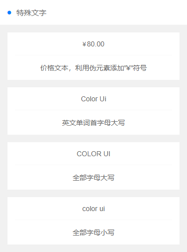

?> 特殊文字



?> 文字样式

```
.text-price  价格文本，利用伪元素添加"¥"符号
.text-Abc  英文单词首字母大写
.text-ABC  全部字母大写
.text-abc  全部字母小写
```

> ##  演示代码

```
<template>
    <view class="padding text-center">
        <view class="padding-lr bg-white">
            <view class="solid-bottom padding">
                <text class="text-price">80.00</text>
            </view>
            <view class="padding">价格文本，利用伪元素添加"¥"符号</view>
        </view>
        <view class="padding-lr bg-white margin-top">
            <view class="solid-bottom padding">
                <text class="text-Abc">color Ui</text>
            </view>
            <view class="padding">英文单词首字母大写</view>
        </view>
        <view class="padding-lr bg-white margin-top">
            <view class="solid-bottom padding">
                <text class="text-ABC">color Ui</text>
            </view>
            <view class="padding">全部字母大写</view>
        </view>
        <view class="padding-lr bg-white margin-top">
            <view class="solid-bottom padding">
                <text class="text-abc">color Ui</text>
            </view>
            <view class="padding">全部字母小写</view>
        </view>
    </view>
</template>

```