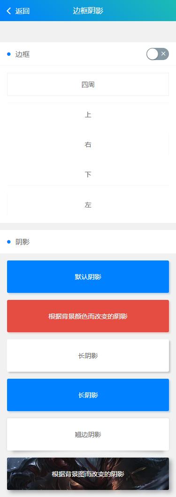

> ## 边框阴影



###  边框
```
.solid  四周-细边框
.solid-top  上-细边框
.solid-right  右-细边框
.solid-bottom  下-细边框
.solid-left  左-细边框

.solid  四周-粗边框
.solids-top 上-粗边框
.solids-right 右-粗边框
.solids-bottom 下-粗边框
.solids-left 左-粗边框
```

###  阴影
```
.shadow 根据背景颜色而改变的阴影
.shadow .shadow-lg 长阴影
.shadow-warp 翘边阴影
.shadow-blur 根据背景图而改变的阴影
```

> ## 演示代码

```html
<template>
	<view>
		<cu-custom bgColor="bg-gradual-blue" :isBack="true"><block slot="backText">返回</block><block slot="content">边框阴影</block></cu-custom>
		<view class="cu-bar bg-white solid-bottom">
			<view class="action">
				<text class="cuIcon-title text-blue"></text>边框
			</view>
			<view class="action">
				<switch class="sm" @change="SetSize" :class="size?'checked':''"></switch>
			</view>
		</view>
		<view class="padding bg-white text-center">
			<view class="padding" :class="size?'solids':'solid'">四周</view>
			<view class="padding margin-top" :class="size?'solids-top':'solid-top'">上</view>
			<view class="padding margin-top" :class="size?'solids-right':'solid-right'">右</view>
			<view class="padding margin-top" :class="size?'solids-bottom':'solid-bottom'">下</view>
			<view class="padding margin-top" :class="size?'solids-left':'solid-left'">左</view>
		</view>
		<view class="cu-bar bg-white margin-top">
			<view class="action">
				<text class="cuIcon-title text-blue"></text>阴影
			</view>
		</view>
		<view class="padding text-center">
			<view class="padding-xl radius shadow bg-white">默认阴影</view>
			<view class="padding-xl radius shadow bg-blue margin-top">根据背景颜色而改变的阴影</view>
			<view class="padding-xl radius shadow shadow-lg bg-white margin-top">长阴影</view>
			<view class="padding-xl radius shadow shadow-lg bg-blue margin-top">长阴影</view>
			<view class="padding-xl radius shadow-warp bg-white margin-top">翘边阴影</view>
			<view class="padding-xl radius shadow-blur bg-red margin-top bg-img" style="background-image:url(https://ossweb-img.qq.com/images/lol/web201310/skin/big91005.jpg);">
				<view>根据背景图而改变的阴影</view>
			</view>
		</view>
	</view>
</template>

<script>
	export default {
		data() {
			return {
				size: false
			};
		},
		methods: {
			SetSize(e) {
				this.size = e.detail.value
			}
		}
	}
</script>

<style>

</style>

```